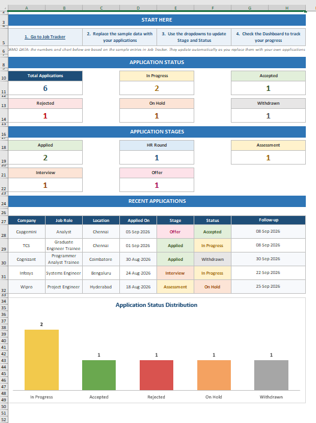
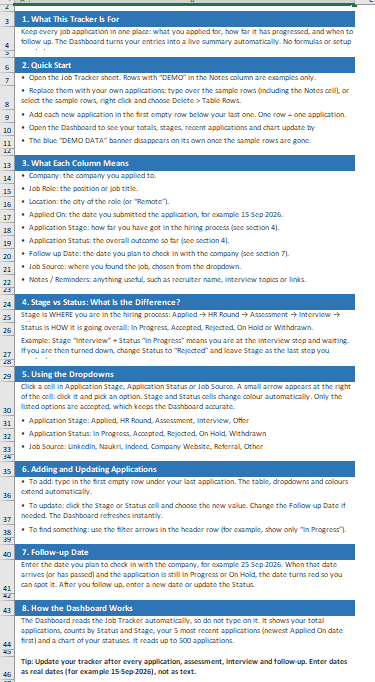

# Fresher Job Search Tracker

An Excel-based job application tracker designed to help freshers organize, monitor, and manage their job search in one place.

## 📌 Project Overview

Searching for multiple jobs can become difficult when application details are spread across different websites, notes, and spreadsheets.

The **Fresher Job Search Tracker** provides a structured way to record job applications, monitor application progress, manage follow-ups, and view overall job-search activity through an interactive Excel dashboard.

## ✨ Features

* 📊 Interactive dashboard for application tracking
* 🏢 Track company names and job roles
* 📍 Record job locations
* 📅 Record application dates and follow-up dates
* 🔄 Track application stages
* 📌 Track application status
* 🌐 Record job sources
* ⬇️ Dropdown menus for easier data entry
* 🎨 Conditional formatting for quick status identification
* 📈 Application status distribution chart
* 📋 Recent applications overview
* 📖 Beginner-friendly instructions
* 🔄 Dashboard updates automatically when application data changes

## 🛠️ Excel Skills Demonstrated

* Excel formulas
* Data validation
* Dropdown lists
* Conditional formatting
* Dashboard design
* Charts and data visualization
* Data organization
* Spreadsheet automation
* User-friendly spreadsheet design

## 🖥️ Project Screenshots

### Dashboard

### Job Tracker

### Instructions

## 🎯 Purpose

This project was created to solve a practical problem faced by job seekers: keeping track of multiple applications and their progress in an organized way.

It also demonstrates how Microsoft Excel can be used to build a structured, interactive, and user-friendly productivity tool.

## 📚 What I Learned

Through this project, I strengthened my understanding of:

* Designing structured Excel workbooks
* Creating interactive dashboards
* Using formulas to summarize data
* Applying data validation and dropdown lists
* Using conditional formatting
* Presenting information through charts
* Designing spreadsheets with the end user in mind

## 🚀 Future Improvements

Possible future enhancements include:

* Automated follow-up reminders
* Additional application analytics
* More dashboard visualizations
* Integration with external job-search data
* Advanced filtering and reporting

## 👩‍💻 Project Type

**Personal Project | Microsoft Excel | Data Tracking & Dashboard**

---

⭐ If you find this project useful, feel free to explore the repository and share your feedback.
